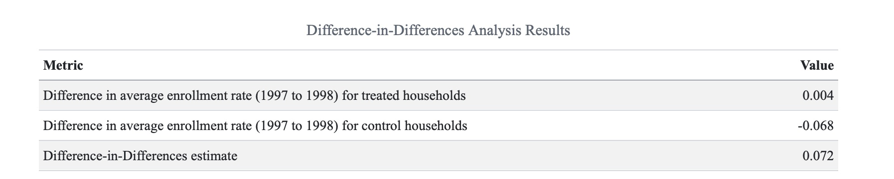

# Progresa Policy Analysis  

This group project conducts a comprehensive policy analysis of the Progresa program, focusing on its impact on children's education outcomes. A variety of econometric methods are used to assess the effectiveness of the program. This is a well-known policy intervention in applied microeconomics and economics of education.

## Methodology

The analysis progresses through multiple stages, using various econometric techniques to understand the impact of the Progresa program:

- **Summary Statistics**: Provides an overview of the key variables and characteristics of the dataset.

- **Ordinary Least Squares (OLS)**: A basic regression model to estimate the effect of the program on educational outcomes.

- **Logistic Regression**: A model used to analyze binary outcomes, such as school attendance.

- **Instrumental Variables (IV)**: Used to address potential endogeneity in the data.

- **Difference-in-Differences (DiD)**: A quasi-experimental approach to estimate the causal effect of the program by comparing treated and control groups over time.

## Files

**`ProgresaEssay.qmd`** A Quarto document providing a concise overview of the analysis and key findings. Can be rendered as an HTML file. Code is obviously included.

**`Progresa.dta`** The dataset used in the analysis.

## Results Example

Below is an example of the results. The image shows the results of the DiD manually constructed (later also done via regression). In both cases, the effect of the treatment on the enrollment status of children is positive. For further details and insights, please refer to the qmd file.



## User Guide

1. **Setup**:
   - Ensure R and Quarto are installed.
   - Download the `Progresa.dta` file and place it in the same directory as the scripts (a relative path is used).
   - Quarto requires additional dependencies such as Pandoc and LaTeX (for PDF) and a web browser (for HTML rendering). Ensure these are installed if needed by running the following in the R console:
     ```r
     install.packages("tinytex")  # Install the TinyTeX package
     tinytex::install_tinytex()    # Install TinyTeX (LaTeX distribution)
     ```
     Quarto **already includes Pandoc**, so no separate installation is required.

2. **Execution**:
   - Render the `ProgresaEssay.qmd` file to an HTML file using Quarto, or alternatively run it chunk by chunk.

3. **Packages**:
   - All required packages are loaded at the beginning of the `.qmd` file for easy reference.
   - If any packages are missing, install them by running the following command in the R console or terminal:
     ```r
     install.packages("package_name")
     ```
     
## Contacts
For any clarifications, questions, or to report issues with the code, feel free to reach out via email at alessandro.dodon@usi.ch. You can also find my LinkedIn link in my GitHub bio.

